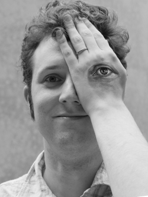

My name is Pontus Stenetorp<a class="fnote" href="#fnote-name">*</a>,
I am a [Japan Society for the Promotion of
Science Postdoctoral Research Fellow][jsps] at
the [University of Tokyo][todai] and find research on
[Natural Language Processing][nlp] (NLP) and [Machine Learning][ml] to be
fascinating.
I am one of the creators of the widely-adopted annotation and visualisation tool
[brat][brat], have carried out research on representations of lexical prior
knowledge and recently published the [first paper][trans] on applying
vector composition
([Deep Learning][deep]) to [dependency parsing][dep].
If you share any of my research interests, do have a look at
my [list of publications][pubs] and if you have questions regarding
my previous and/or current research, feel free to [contact me][contact].
I am currently a member of the [Tsuruoka Laboratory][tsuru]
at the Faculty of Engineering and received a Ph.D. in 2013
from the Faculty of Science at the University of Tokyo and
a M.Sc.Eng. in 2010 from the [Royal Institute of Technology][kth] (KTH).
During what little spare time I have left after work, I enjoy producing code
for fun ("hacking"), biking, reading and [photography][photo].

* Technically my name is Pontus Lars Erik
Saito Stenetorp or
西東 ステネートルプ ポントス ラース エリック,
but buy me a drink some time and I will tell you all about how
I ended up with possibly the longest name in Japan and what it does to your
average company customer database.

[brat]:     http://brat.nlplab.org/
[contact]:  /contact.html
[deep]:     https://en.wikipedia.org/wiki/Deep_learning
[dep]:      http://en.wikipedia.org/wiki/Dependency_grammar
[jsps]:     http://www.jsps.go.jp/english/
[kth]:      http://www.kth.se/?l=en_UK
[ml]:       https://en.wikipedia.org/wiki/Machine_learning
[nlp]:      https://en.wikipedia.org/wiki/Natural_language_processing
[photo]:    /photography.html
[pubs]:     /publications.html
[todai]:    http://www.u-tokyo.ac.jp/index_e.html
[trans]:    /res/pdf/stenetorp2013transition.pdf
[tsuru]:    http://www.logos.t.u-tokyo.ac.jp/
